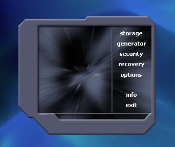



## Password Fox  \[ Complete Password Tools \]

### Description

This program has it all when it comes to anything that has to do with passwords. Features: Password Storage with simple encryption, Password Generator, Password Strength Checker, and Password Recovery Tool. Most of all, it is packaged with my specialty, an elite iface that is sure to inspire any of your future work (check the screenshot)!. Password Fox is a complete application I decided to share on PSC due to all I have learned from this site. Comments are more appreciated then votes!
 
### More Info
 

             |
---                |---
**Submitted On**   |2008-03-01 11:17:20
**By**             |[Tom Emery](https://github.com/Planet-Source-Code/PSCIndex/blob/master/ByAuthor/tom-emery.md)
**Level**          |Intermediate
**User Rating**    |5.0 (25 globes from 5 users)
**Compatibility**  |VB 5\.0, VB 6\.0
**Category**       |[Complete Applications](https://github.com/Planet-Source-Code/PSCIndex/blob/master/ByCategory/complete-applications__1-27.md)
**World**          |[Visual Basic](https://github.com/Planet-Source-Code/PSCIndex/blob/master/ByWorld/visual-basic.md)
**Archive File**   |[Password\_F210426312008\.zip](https://github.com/Planet-Source-Code/tom-emery-password-fox-complete-password-tools__1-70184/archive/master.zip)

